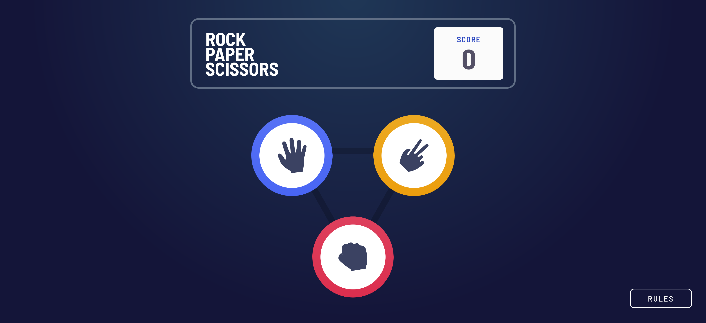
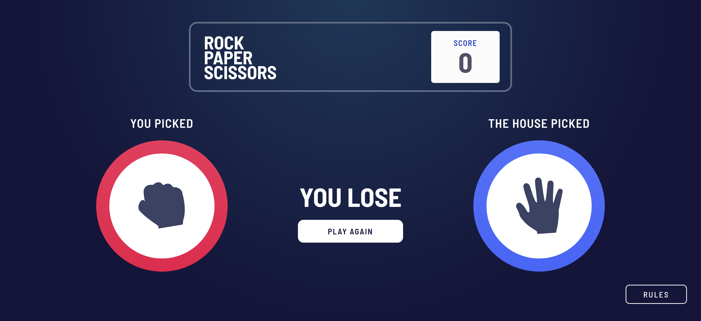
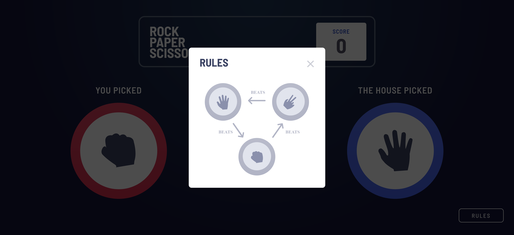
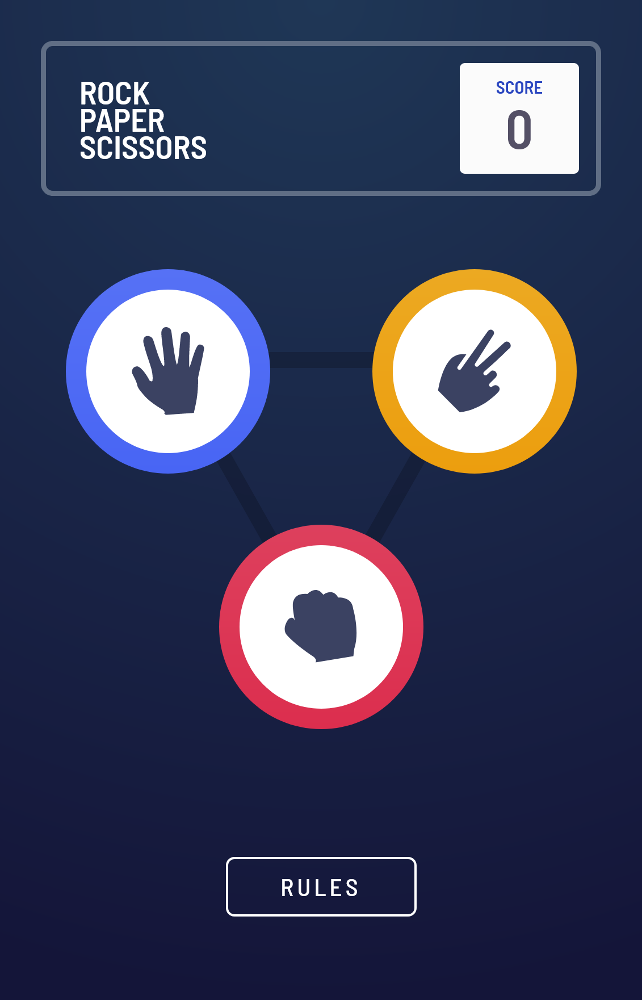
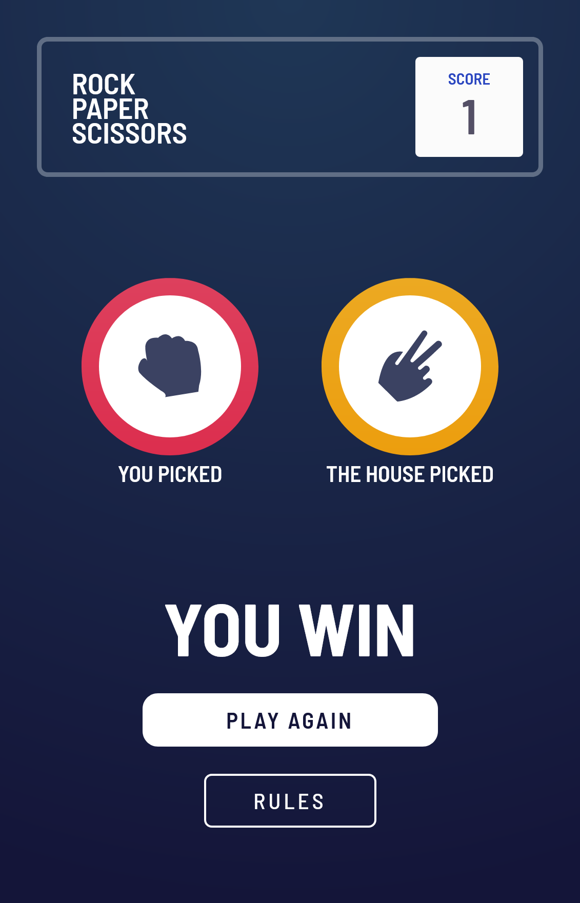

# Frontend Mentor - Rock, Paper, Scissors solution

This is a solution to the [Rock, Paper, Scissors challenge on Frontend Mentor](https://www.frontendmentor.io/challenges/rock-paper-scissors-game-pTgwgvgH). Frontend Mentor challenges help you improve your coding skills by building realistic projects. 

## Overview

### The challenge

Users should be able to:

- View the optimal layout for the game depending on their device's screen size
- Play Rock, Paper, Scissors against the computer

### Screenshot

### Links

- Solution URL: [https://github.com/liliaferrouk/rock-paper-scissors](https://github.com/liliaferrouk/rock-paper-scissors)
- Live Site URL: [https://liliaferrouk.github.io/rock-paper-scissors/](https://liliaferrouk.github.io/rock-paper-scissors/)

## My process

### Built with

- Semantic HTML5 markup
- CSS
- Flexbox
- Mobile-first workflow
- [React](https://reactjs.org/) - JS library

## Author
- Frontend Mentor - [@liliaferrouk](https://www.frontendmentor.io/profile/liliaferrouk)

